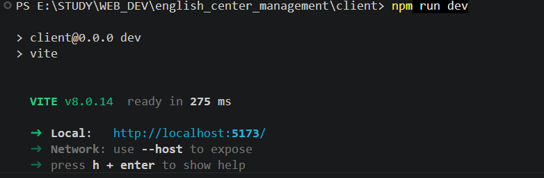

# **Hướng dẫn chạy source code sau khi clone hoặc kéo source code về**

## Các bước làm việc

### Trong thư mục client

1. Di chuyển vào thư mục <source-code>/client

- Mở `powershell`, `terminal trên linux hoặc macos` hoặc `terminal trong vs code`
- Thực hiện lệnh sau:

```bash
cd <duong-dan-cua-source-code>/client
```

2. Cài đặt các module của nodejs

- Folder `node_modules` không có trên github vì nó quá nặng nên cần phải cài lại.
- Thực hiện lệnh sau:

```bash
npm install
#hoặc
npm i
```

3. Chạy source code

- Thực hiện lệnh sau:

```bash
npm run dev
```

-Sau khi chạy, kết quả sẽ như sau:
;

### Trong thư mục server

1. Di chuyển vào thư mục <source-code>/server

- Mở `powershell`, `terminal trên linux hoặc macos` hoặc `terminal trong vs code`
- Thực hiện lệnh sau:

```bash
cd <duong-dan-cua-source-code>/server
```

2. Cài đặt các module của nodejs

- Folder `node_modules` không có trên github vì nó quá nặng nên cần phải cài lại.
- Thực hiện lệnh sau:

```bash
npm install
#hoặc
npm i
```

3. Chạy source code

- **Cập nhật sau**
